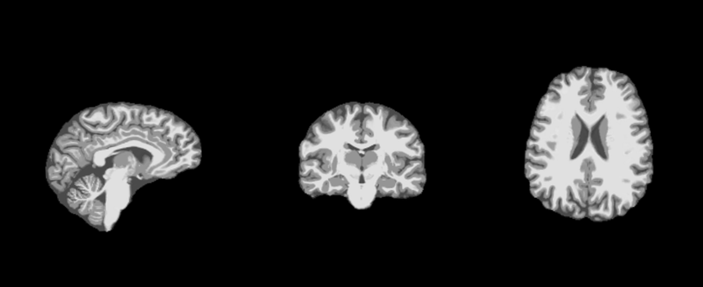
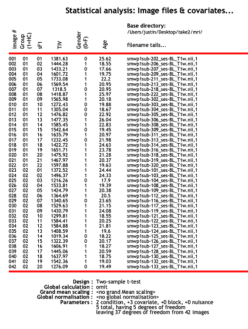
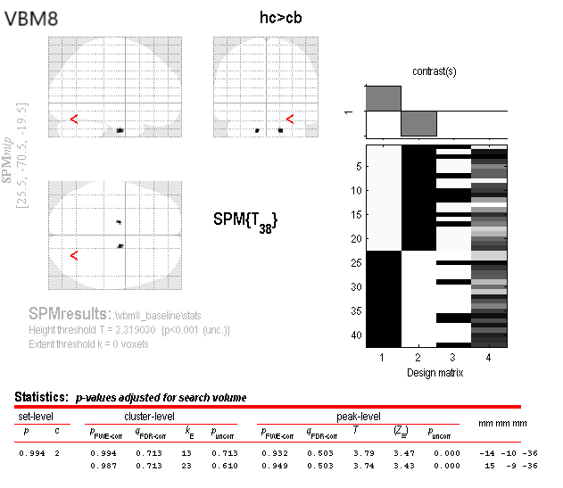
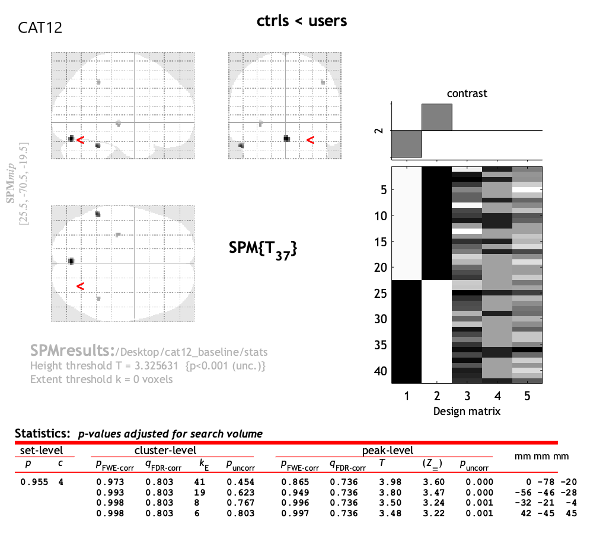
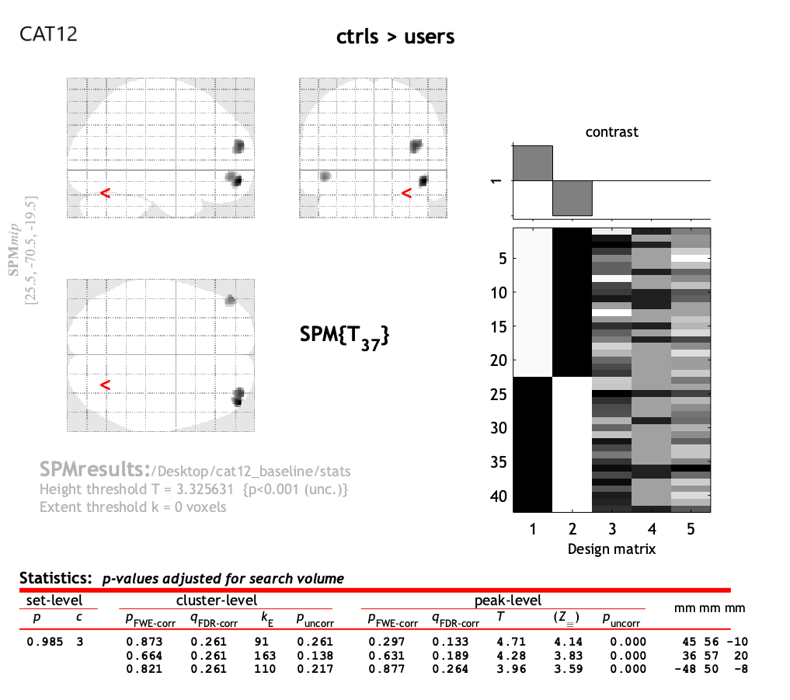
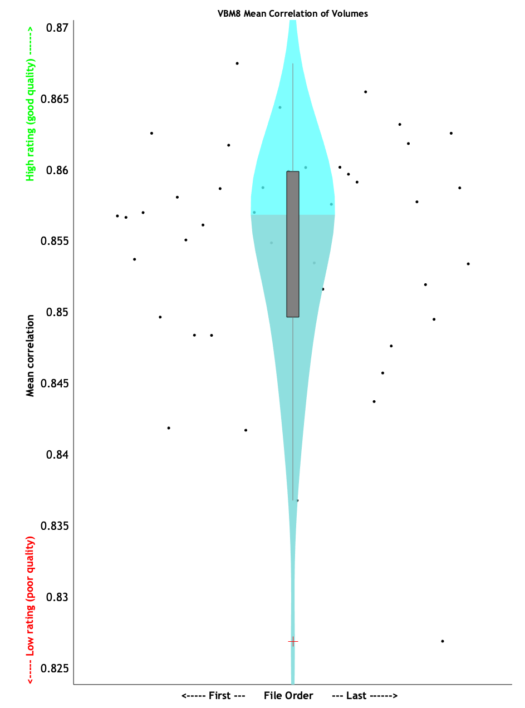

# Introduction
## Justification for experiment
This study examines structural brain changes in young adult cannabis users in a longitudinal design. This study is pertinent to my research interests because I will be studying structural-functional relationships in adolescent brain development using similar neuroimaging methods. It will be beneficial to have experience with this structural processing pipeline and with SPM software.

## Description of paper
The study by Koenders et al. examined whether structural brain changes were associated with substance use (focusing on cannabis) over a three-year period. The participants of the study were young adult users and matched healthy controls. The study used a magnetic resonance imaging (MRI) technique called voxel-based morphometry (VBM) to measure grey matter volume (GMV) changes. They assessed drug usage with questionnaires for nicotine, alcohol, and cannabis usage. 

I aim to replicate the study’s finding of significant cerebellar differences between users and healthy controls at baseline using the authors’ voxel-based morphometry pipeline and a two-sample t-test.

## Description of stimuli and procedures
I will be using the subject T1-weighted MRI baseline and follow-up scan data from OpenNeuro. (https://openneuro.org/datasets/ds000174/versions/1.0.1). SPM8 software will be used to conduct voxel-based morphometry analysis (using VBM8 of SPM).

## VBM Procedure Overview:

1. Segmentation of T1w data into grey matter and white matter
2. Grey matter normalization using DARTEL
3. Voxel smoothing
4. Statistical analysis

## Anticipated Challenges
- Reproducing the VBM pipeline steps when explicit parameter values are not listed
- Possible software incompatability with SPM8
- May need to use SPM12 instead of SPM8

## Links
Project Repository: https://github.com/psych251/koenders2016

Original Paper: https://github.com/psych251/koenders2016/tree/master/original_paper

## Methods

### Planned Sample

The sample for this pipeline reproduction consists of heavy cannabis users (CB,n=20, age baseline M=20.5, SD=2.1) and non-cannabis using healthy controls (HC,n=22 age baseline M=21.6, SD=2.45). T1-weighted MRI data comes from OpenNeuro.org.

### Materials
The materials required for this VBM pipeline reproduction are 1) the MRI dataset and 2) neuroimaging processing software. Both are available online and summarized below:

1. MRI dataset - 3T structural MRI scans were downloaded from OpenNeuro with the parameters as follows: T1 turbo field echo, TR 9.6 s, TE 4.6 s, 182 slices, slice thickness 1.2 mm, FOV 256x256 mm, in-plane resolution 256x256mm, flip angle 8°. See Links section for OpenNeuro source.

2. SPM software - the pipeline will be run in SPM8 (Structural Brain Mapping Group), specifically employing the VBM-8 module. SPM requires Matlab.

**Replication study differences:**
Dependent on software compatability, SPM12 may be used instead of SPM8.

### Procedure	
**Voxel-based morphometry**  
*Quoted from study:*
"For both the cross-sectional and the longitudinal analyses, we used the VBM-8 module of
the software package SPM (Structural Brain Mapping Group, University of Jena, Germany,
http://dbm.neuro.uni-jena.de/vbm8). For the cross-sectional analyses, at baseline and followup,
individual T1 images were first aligned to a T1 template in MNI-space (Montreal Neurological Institute) and subsequently segmented into grey matter, white matter and cerebro-
spinal fluid. The resulting grey matter was normalized using the diffeomorphic image registration
algorithm (DARTEL) [33]. Grey matter images were modulated with the nonlinear
transformation parameters as computed during the normalization procedures. The resulting
images contain the volume proportion of probabilistically assigned grey matter tissue for
each voxel. These grey matter tissue probability images were visually inspected again and
finally smoothed with an 8-mm Gaussian kernel. Note that each image of the regional grey
matter volume was corrected for individual brain size, since this step is part of the VBM8
toolbox routine."

**Replication Study Differences:**  
SPM12 may be used for the VBM processing pipeline instead of SPM8 due to possible incompatabilities of the older SPM8 / VBM-8 module and the current version of Matlab 2019a. If SPM12 is employed, the CAT12 VBM module will be used instead of VBM-8.

This replication will focus on the cerebellum cluster as it was the primary baseline finding.

### Analysis of VBM Data

The key analysis of interest is a two-sample t-test of the grey matter volumes at baseline between the cannabis users group and the healthy control group. The result of interest is a significant difference of GMV located at the cerebellum between users and controls.

Significance was defined as follows:
"For all analyses, we first performed region of interest ROI analyses, where structural differences within ROI masks were considered significant if p < .001, with an FWE-corrected cluster probability of p < .05 adjusted for the small search volume [36].

### Differences from Original Study

The main difference between this pipeline reproduction and the original study is the possible usage of SPM12. This possibility is not likely as it should be straightforward to resolve incompatabilities by using an older version of Matlab (e.g. one released around SPM8 like R2014b).

## Results

### VBM Preprocessing

### 10/27/2019 - Status Update

*CAT12 pipeline: VBM preprocessing completed using Matlab 2019b on MacOS 10.15. Preparing for statistical analysis.*

*VBM8 pipeline: tissue segmentation completed using Matlab 2014a Windows 10. Undergoing visual inspection and then smoothing.*

Segmentation and rigid-body spatial registration to the DARTEL template has been carried out on all subjects using SPM12 CAT12. Partial volume estimates, grey matter, and white matter images are displayed in Figures 1-4. This took 26 processing hours, running in parallel. Logs are located in the *spm_logs* directory. Images were visually inspected for quality control (examining accuracy of tissue separation and other artifacts). Total intracranial volume (TIV) was estimated for each subject followed by spatial smoothing using an 8mm Gaussian kernel. 

The original study's methods do not work using MacOS 10.15, even when accomodating for old Matlab versions (2014a). They do run in Windows 10, so currently the "true" replication is being carried on a Windows 10 computer running Matlab 2014a and using SPM8/VBM8 toolbox. Segmentation has been completed using this VBM8 pipeline.

I will try to complete both pipelines and see how they compare to the original study's findings.

### 11/16/2019 - Status Update
*Overall, the processing has been completed but I have been unable to replicate the findings.*

Both the new (CAT12) and original (VBM8) processing pipelines have been completed. All imaging data has been processed up to the 8mm kernel smoothing stage (see Fig.5) and has undergone statistical analysis. 

The statistical analysis is conducted by setting up a statistical model using SPM's GLM tool (Fig. 6), and then defining the contrasts of the two-sample t test (in this case users > ctrl or users < ctrl). I was able to set up and analyze the data following the author's methods and also using the tool's official documentation. I set total intracranial volume (TIV) as a covariate similar to the authors.

No significant clusters appeared in either contrast when controlling for multiple comparisons (FWE @ 0.05). This was true for both pipelines. The two figures below show the results of the analysis for the two contrasts, when using the modern CAT12 pipeline. The original VBM8 looks similar.

I had to remove all statistical thresholds (no multiple comparisons corrections) and cluster size thresholds (clusters can be very small) to get some regions to appear. I also entered the coordinates of the key finding (the larger cerebellum grey matter volume in users at baseline [26,-70,-20]) and did not observe any GMV differences.

Although I followed the data processing instructions as indicated, I am going through both pipelines again. I suspect there may have been a missed step in the initial segmentation because there are multiple parameters and smaller steps wrapped into a single batch process. Another possibility is that the statistical analysis may have been incorrectly entered.

### 12/2/2019 - Status Update

While going through both pipelines for a second attempt, I realized that I did not use the proper covariates in the statistical analysis. The authors included age and sex as covariates, and total intracranial volume was automatically adjusted for in VBM8’s initial segmentation step. CAT12 required the user to manually calculate and include TIV measures into the design matrix. However, I could not reproduce the cerebellum finding after the inclusion of these covariates.

The figures below show the VBM results from the reproduction. The significance thresholds are uncorrected for multiple comparisons in order to visualize the regions of grey matter volume difference. Two brain figures and results tables are shown for both VBM8 and CAT12 pipelines. They represent the contrasts from the t-test: controls < users and controls > users. The red arrow indicates where the original cerebellar finding was located approximately. Although there were no significant clusters after FWE-correction, it is interesting that the two pipelines produced different clusters from the same data. 

### Confirmatory analysis

I could not reproduce the key finding of pFWE = .035. In my replication attempt, the following clusters showed the greatest significance:

* VBM8: pFWE-corr = 0.351, cluster size = 311, x,y,z = -11,-42,-26
* CAT12: pFWE-corr = 0.973, cluster size = 41, x,y,z = 0, -78, -20

### Exploratory Analyses
 
I conducted the full VBM processing pipeline on the follow-up data. Neither the VBM8 nor CAT12 versions yielded significant results after FWE-corrections.

An additional exploratory analysis was run to examine sample homogeneity after segmentation and registration to a standard template. Violin plots below show the average correlation between a subject’s pre-processed data and all other subjects in the sample. Higher correlations indicate proper tissue segmentation and standardization to the DARTEL template, resulting in overall improved data quality.

The mean correlation analysis suggests both versions of the SPM VBM pipeline can produce high quality tissue segmentation and also do a good job registering the segmentated data to the DARTEL standard template. The CAT12 pipeline slightly outperformed the VBM8 pipeline. The VBM8 method resulted in two volumes with mean correlations over two standard deviations away from the group average; the CAT12 method had one. 

## Discussion

### Summary of Replication Attempt

The authors originally reported the following significant finding: 
"Our previously reported cross-sectional finding of a cluster with larger grey matter volume in
the CB group compared to the HC group in the cerebellum [17] is still significant in the present
sample at baseline (cluster size = 393, pFWE = .035, x,y,z = 26,-70,-20)." 

I tried to replicate this cerebellum finding using two different pipelines: 1) the author's VBM8 processing pipeline used in SPM8, and 2) the newer CAT12 method used in SPM12. I was unsuccessful in replicating the baseline cerebellum grey matter volume difference result.

### Commentary
I think the main reason behind the failure to reproduce is that the Methods section of the manuscript lacked detailed information of specific values and settings. The paper provided an overview of the steps, but I still had to rely on external sources to carry out the analysis including: the SPM8 and SPM12 instruction manuals for VBM8 and CAT12, watching SPM vbm tutorials on Youtube, and using the SPM user forum.
An important point brought up by this project is the difference between VBM8 and CAT12. Both pipelines conduct the same VBM steps, but CAT12 showed higher data quality and segmentation accuracy than the older VBM8. This finding has been shown by other groups using the two methods to study temporal lobe epilepsy brain segmentation^1^. Ultimately, this hinders the interpretation of the study’s results. This also highlights the importance of adopting pipeline standards across groups. Current attempts at this include the Brain Imaging Data Structure (BIDS) format and fMRIPrep, an automated pipeline adopted by many functional neuroimaging groups.

*^1^Farokhian F, Beheshti I, Sone D, Matsuda H. Comparing CAT12 and VBM8 for Detecting Brain Morphological Abnormalities in Temporal Lobe Epilepsy. Front Neurol. 2017;8:428. Published 2017 Aug 24. doi:10.3389/fneur.2017.00428*
